<div align="center">

<!-- Animated Constellation Banner -->


<!-- Typing Animation -->
<a href="https://yhaddar.com">
  
</a>

<br/>

<!-- Profile Views & Social Badges -->
<p>
  
  <a href="https://www.linkedin.com/in/youssef-haddar-b27766220/">
    
  </a>
  <a href="https://github.com/yhaddar">
    
  </a>
  <a href="https://yhaddar.com">
    
  </a>
  <a href="mailto:youssefhaddar9@gmail.com">
    
  </a>
</p>

</div>

---

<!-- About Me Section -->
### 👨‍💻 About Me

<div style="display: flex; flex-direction: row-reverse; justify-content: space-evenly">


```yaml
name: HADDAR Youssef
location: Salé, Morocco 🇲🇦
role: Backend & Mobile Developer
focus: Spring Boot · Flutter · Data Science · ML

education:
  - Licence Big Data & BI @ Faculté Polydisciplinaire (2025–present)
  - Full Stack Dev @ CMC Rabat (2023–2025) 🎓 Graduated with Honors

currently:
  - Building real estate & recipe apps
  - Exploring Big Data with Spark & Hadoop
  - Working on Sales Analytics & AI prediction

interests:
  - ⚽ Football
  - 📚 Reading
  - 🎌 Anime
  - 🧠 Machine Learning
```

</div>

<br clear="right"/>

---

<!-- 3D Contribution Snake -->
<div align="center">

### 🐍 My Contribution Snake

<picture>
  <source media="(prefers-color-scheme: dark)"
    srcset="https://github.com/yhaddar/yhaddar/blob/output/github-contribution-grid-snake-dark.svg" />
  <source media="(prefers-color-scheme: light)"
    srcset="https://github.com/yhaddar/yhaddar/blob/output/github-contribution-grid-snake.svg" />
  
</picture>

</div>

---

<!-- Tech Stack -->
## 🛠️ Tech Stack & Tools

<div align="center">

### 📱 Mobile Development
<p>
  
  
  
  
</p>

### ⚙️ Backend Development
<p>
  
  
  
  
  
  
  
</p>

### 🌐 Frontend Development
<p>
  
  
  
  
  
  
</p>

### 🤖 Data Science & ML
<p>
  
  
  
  
  
  
  
</p>

### 🗄️ Databases
<p>
  
  
  
  
</p>

### 🔧 DevOps & Tools
<p>
  
  
  
  
  
  
</p>

</div>

---

<!-- GitHub Stats -->
## 📊 GitHub Stats

<div align="center">
  <a href="https://awesome-github-stats.azurewebsites.net/index.html??cardType=level&theme=dark&fontFamily=&preferLogin=false">      </a>

</div>
<div align="center">

</div>

<!-- Projects Showcase -->
## 🏗️ Projects Showcase

| 🚀 Project | 🛠️ Stack | 📝 Description |
|---|---|---|
| 🏠 **OHO Real State** | Flutter · Supabase · AI Chatbot | Real estate mobile app with listing, booking & geolocation |
| 📊 **Sale Analytics & Prediction** | Spark · Python · ML · Hadoop · Tableau | End-to-end data pipeline with AI sales forecasting |
| 😤 **Stress Quality** | Flutter · Scikit-learn · Python | ML-powered mobile app to analyze & predict stress levels |
| 📚 **Library Management** | Spring Boot · Next.js · TypeScript · Tailwind | Full-featured library borrowing & reservation system |
| 🌾 **Agriculture Platform** | Laravel · React · Figma · AWS S3 · Stripe | E-commerce platform helping farmers sell their products |
| 🍔 **Food Delivery App** | Flutter · Firebase | Intuitive meal ordering with real-time tracking |
| 🖼️ **Photos (Pinterest Clone)** | Laravel · React · SCSS | Image sharing & management platform |
| 📦 **Stock Management** | Node.js · Express · Next.js · MongoDB | Full inventory, sales & workforce management system |
| 🛋️ **Furniture Store** | Java · XML · Express.js | Elegant furniture e-commerce mobile experience |
| 🔮 **Diabetes Prediction** | Python · ML · Scikit-learn | Supervised ML model for diabetes risk prediction |
| 🛒 **E-commerce (Vulcapro)** | Symfony · PHP · Tailwind · MySQL | Industrial supplies conveyor management platform |
| 📊 **Product Classification** | Python · ML · Pandas | ML classifier for product profitability optimization |

---

<!-- Activity Graph -->
## 📈 Contribution Activity

<div align="center">
  
</div>

---

<!-- Achievements -->
## 🏆 Achievements

<div align="center">


</div>

---

<!-- Experience Timeline -->
## 📅 My Journey

```
2020 ───▶ Baccalaureate (SVT) @ Lycée Jaber Bno Hayan, Salé
2021 ───▶ Faculty of Sciences (Biology) @ Rabat + 🔥 Started self-learning CS
2022 ───▶ Faculty of Economics @ Salé
2023 ───▶ CMC Rabat — Full Stack Digital Development (Bac+2)
           └── Flutter, Spring Boot, Laravel, React, Data Science...
2025 ───▶ 🎓 Graduated with Honors + Internship @ Proxisoft (Symfony · Twig)
           └── Now pursuing Licence Big Data & BI @ Faculté Polydisciplinaire
2025+ ──▶ Freelance projects in Web, Mobile & AI 🚀
```

---

<!-- Languages -->
## 🌍 Languages

<div align="center">


</div>

---

<!-- Contact Section -->
## 📬 Let's Connect

<div align="center">

<a href="https://yhaddar.com">
  
</a>
<a href="mailto:youssefhaddar9@gmail.com">
  
</a>
<a href="https://www.linkedin.com/in/youssef-haddar-b27766220/">
  
</a>

<br/><br/>

> *"I enjoy tackling challenging projects and delivering high-quality solutions."*
> — Youssef Haddar

</div>

---

<!-- Footer Wave -->
<div align="center">
  
</div>